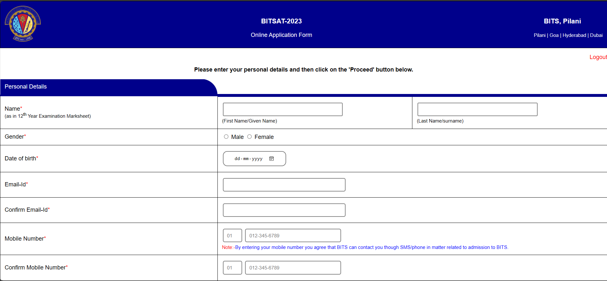

# Online Application Form Clone

This project is a frontend clone of a multi-page online application form.  
It simulates a real-world admission form workflow with multiple steps and user input fields.

Live Demo: https://your-username.github.io/online-application-form-clone/

## 🚀 Features

- Multi-step (4 page) application form 
- Clean and consistent UI across pages   
- Form fields with labels and placeholders  
- User-friendly form layout  


## 🛠️ Technologies Used

- HTML5  
- CSS3  


## 📁 Project Structure
```text
online-application-form-clone/
│── index.html
│── page2.html
│── page3.html
│── page4.html
│
├── css/
│ └── style.css
│
├── images/
│ ├── logo.png
│ ├── captcha.png
│ ├── payu.png
│ └── paytm.png
│
└── README.md
```
<<<<<<< HEAD


=======

>>>>>>> 1cc989759ac9ce62420819d92b6b27ff5f753364
